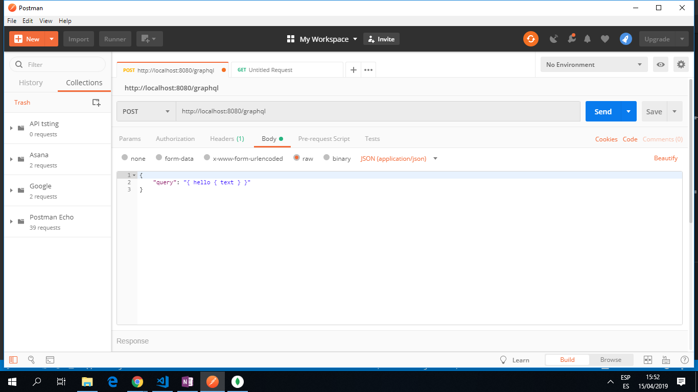

# :zap: Nodejs Tutorial Rest API

* This is an app to practise working with Representational State Transfer (REST) APIs that just transfer data instead of user interfaces.

* **Note:** to open web links in a new window use: _ctrl+click on link_


## :page_facing_up: Table of contents

* [:zap: Nodejs Tutorial Rest API](#zap-nodejs-tutorial-rest-api)
  * [:page_facing_up: Table of contents](#page_facing_up-table-of-contents)
  * [:books: General info](#books-general-info)
  * [:camera: Screenshots](#camera-screenshots)
  * [:signal_strength: Technologies](#signal_strength-technologies)
  * [:floppy_disk: Setup](#floppy_disk-setup)
  * [:computer: Code Examples](#computer-code-examples)
  * [:cool: Features](#cool-features)
  * [:clipboard: Status & To-Do List](#clipboard-status--to-do-list)
  * [:clap: Inspiration](#clap-inspiration)
  * [:file_folder: License](#file_folder-license)
  * [:envelope: Contact](#envelope-contact)

## :books: General info

* This app creates simple get and post routes/controllers to send and receive data, as well as header and status information.
* A Postman API and a [Codepen REST API test app](https://codepen.io/AndrewJBateman/pen/dwbVaX?editors=0010) are used to send/receive data.

## :camera: Screenshots

.

## :signal_strength: Technologies

* [multer v1](https://www.npmjs.com/package/multer) is the middleware used for uploading files.
* [socket.io v2](https://socket.io/) is added for real-time event-based communications.
* [graphql v14](https://www.graphql.org/) is added, a query language for APIs.
* [bcrypt v2](https://www.npmjs.com/package/bcrypt) library used to hash passwords.
* [mongoose v5](https://mongoosejs.com/) object modelling for node.js.
* [Postman](https://www.getpostman.com/) API dev platform used.
* [Codepen 'REST API test'](https://codepen.io/AndrewJBateman/pen/dwbVaX?editors=1010) used to test the app.

## :floppy_disk: Setup

* Create MongoDB Atlas Cloud database (or local installed MongoDB database) and add user access/database credentials to a new `.env` file - referred to in `app.js`.
* Add IP address to MongoDB Atlas Network Access whitelist. Or simply whitelist all (IP address 0.0.0.0/0).
* Run `npm start` for a dev server. Navigate to `http://localhost:8080/`. The app will automatically reload if you change any of the source files.

## :computer: Code Examples

* getPosts method from controllers\feed.js

```javascript

exports.getPosts = async (req, res, next) => {
  const currentPage = req.query.page || 1;
  const perPage = 2;
  try {
    const totalItems = await Post.find().countDocuments();
    const posts = await Post.find()
      .populate('creator')
      .sort({ createdAt: -1 })
      .skip((currentPage - 1) * perPage)
      .limit(perPage);

        // return a response with json data
    res.status(200).json({
      message: 'Fetched posts successfully.',
      posts: posts,
      totalItems: totalItems
    });
  } catch (err) {
    if (!err.statusCode) {
      err.statusCode = 500;
    }
    next(err);
  }
};

```

## :cool: Features

* MongoDB cluster set up with usernme and password.

## :clipboard: Status & To-Do List

* Status: Part complete & working, Connects to database but nothing viewed on `localhost://8080`. `localhost://8080/graphql` works
* To-Do: Complete course & update code. Also requires more commenting and screen shots.

## :clap: Inspiration

* [NodeJS - The Complete Guide (incl. MVC, REST APIs, GraphQL sections 24 and other sections)](https://www.udemy.com/nodejs-the-complete-guide/).

## :file_folder: License

* This project is licensed under the terms of the MIT license.

## :envelope: Contact

* Repo created by [ABateman](https://github.com/AndrewJBateman), email: gomezbateman@yahoo.com
